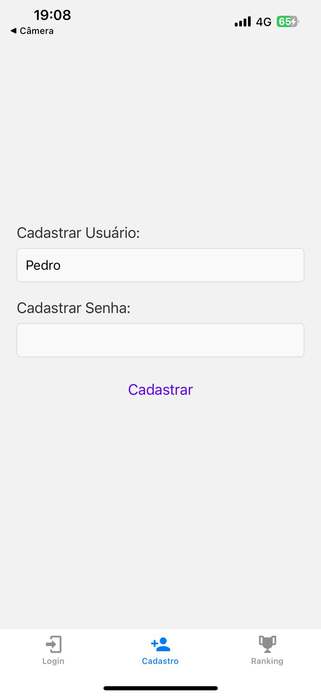
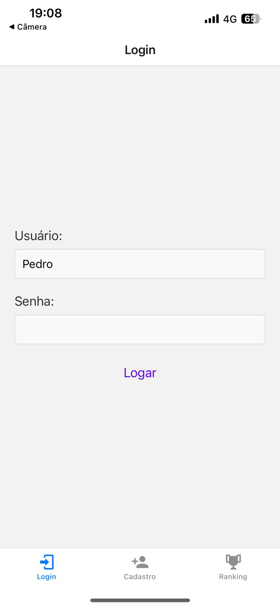
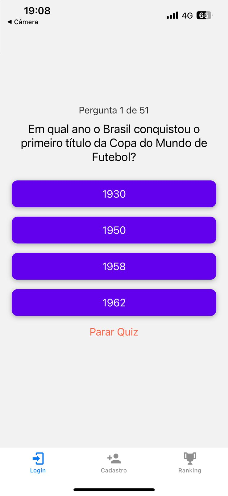
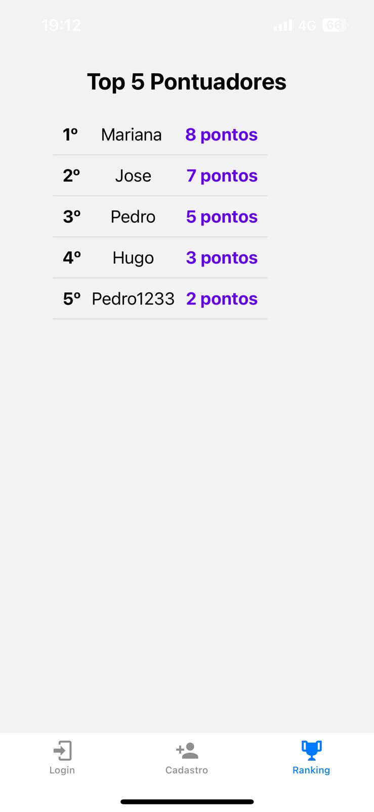

# Aplicativo de Quiz em React Native

Este projeto foi desenvolvido como parte de um trabalho acadêmico e tem como objetivo a criação de um aplicativo de quiz interativo, utilizando **React Native**. O app permite que o usuário faça login, participe de um quiz com até 51 perguntas, registre sua maior pontuação e visualize o ranking dos maiores pontuadores.

## Visão Geral

O projeto é um aplicativo de quiz com as seguintes funcionalidades:

1. **Tela de Login e Cadastro**: O usuário deve fazer login ou se cadastrar para acessar o quiz.
2. **Tela de Quiz**: O usuário responde perguntas de múltipla escolha e tem a opção de responder ou salvar sua pontuação.
3. **Tela de Ranking**: O app exibe o ranking dos cinco maiores pontuadores.

Este aplicativo é desenvolvido com **React Native** e utiliza o **AsyncStorage** para gerenciamento de autenticação e armazenamento de pontuação.

## Componentes Utilizados

- **React Native**: Framework para desenvolvimento do aplicativo móvel.
- **AsyncStorage**: Para login, cadastro de usuários, pontuações e rankings.
- **React Navigation**: Para navegação entre as telas do aplicativo.
- **Motores de Vibração**: Para ter um sinal tatil de acerto

## Como Funciona o Aplicativo

### Tela de Login e Cadastro

Na tela inicial, o usuário é apresentado com duas opções: **Login** ou **Cadastro**. O login é feito através de e-mail e senha utilizando **AsyncStorage**. Caso o usuário ainda não tenha uma conta, ele pode se cadastrar diretamente na mesma tela. Não é ppssivel ter dois usuarios com o mesmo nome!

  

### Tela do Quiz

Após o login bem-sucedido, o usuário é direcionado para a tela do **quiz**. O quiz contém até 50 perguntas de múltipla escolha. O usuário deve responder cada pergunta antes de avançar para a próxima. A pontuação é atualizada conforme as respostas são fornecidas.

- **Regras da Tela do Quiz**:
  - O usuário deve responder a uma pergunta antes de prosseguir para a próxima.
  - Quando uma pergunta for respondida corretamente, o celular vibrará
  - Se o usuário quiser salvar sua pontuação antes de completar o quiz, ele pode optar por isso a qualquer momento.
  - Caso o usuario tente responder a questão e erre, a pontuação não será considerada.
 

### Tela de Ranking

Após o fim do quiz, ou ao salvar a pontuação, o aplicativo direciona o usuário para a tela de **ranking**, onde ele pode visualizar os cinco maiores pontuadores, ordenados do maior para o menor.

- **Regras da Tela de Ranking**:
  - Os cinco maiores pontuadores são listados na tela.
  - O ranking é atualizado sempre que um novo usuário ou pontuação superior for registrado.
 

  

## Instruções de Uso

1. Copie o código App.Js
2. Crie um Snack no site **Expo.go**
3. Cole o cogigo no arquivo App;js
4. Teste pelo celular ou pela aba WEB

## Autor

- Pedro Henrique Satoru
